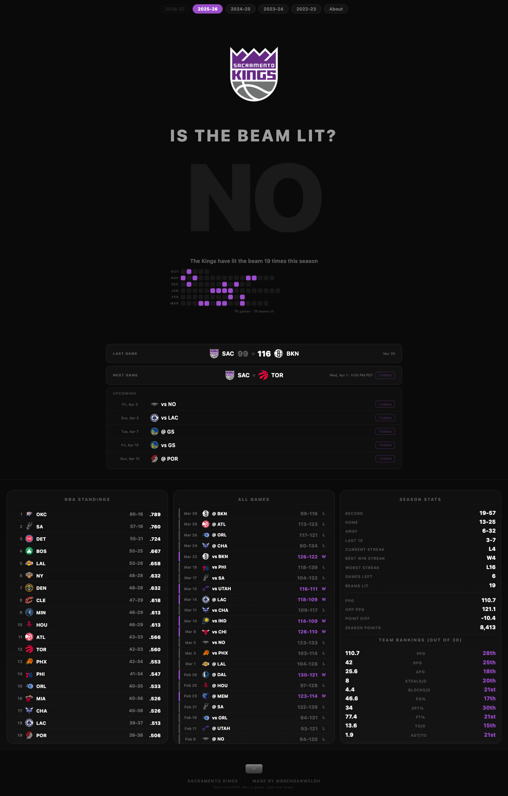

<p align="center">
  
  
  
  
  
</p>

<h1 align="center">Light the Beam</h1>
<p align="center"><strong>Is the Beam Lit?</strong></p>
<p align="center">
  <a href="https://lightthebe.am">lightthebe.am</a>
</p>

<p align="center">
  
</p>

---

## About

Sacramento Kings fan page. After every Kings win, Golden 1 Center lights a purple beam into the sky. This site tracks that: did they win tonight? Live scores, beam calendar, season stats, standings, and a few easter eggs. All data comes from the ESPN API on page load. Single HTML file, no backend.

## Features

- **Beam status**: Giant YES/NO that updates from ESPN. Wins trigger a purple beam CSS effect across the page.
- **Beam calendar**: Monthly dot grid for the season. Purple = win, dim = loss. Hover a dot to see that game's details.
- **Season selector**: 2025-26, 2024-25, 2023-24, 2022-23. Each loads full season data.
- **Last/next game**: Most recent score and upcoming opponent with tip-off time + ticket link.
- **Upcoming schedule**: Next 5 games with opponents, dates, ticket links.
- **NBA standings**: Full league with logos, records, win%.
- **Game log**: Every game this season with scores and W/L.
- **Season stats**: Record, streaks, PPG, opponent PPG, point diff, team rankings out of 30.
- **Easter egg**: Tap the Kings logo 5x to light the beam manually.
- **About page**: Kings photos and social links.

## Data Flow

```
Page Load
  |
  v
ESPN Scoreboard API
  |
  v
Parse wins, losses, scores, opponents, dates
  |
  v
Render beam status, calendar, standings, stats
  (all client-side, no backend)
```

## Tech Stack

| Layer | Technology |
|-------|-----------|
| Frontend | Vanilla HTML/CSS/JS, 822 lines |
| Data | ESPN Scoreboard API (client-side fetch, no key needed) |
| Logos | ESPN CDN |
| Animations | CSS keyframes |
| Hosting | Cloudflare Pages |

## Assets

| File | What it is |
|------|-----------|
| `bibby.png` / `bibby-full.png` | Mike Bibby photos (about page) |
| `beam-house.png` / `beam-tv.png` | Beam ceremony photos |
| `kings-classic.png` / `kings-logo.png` | Kings logos |
| `_headers` / `_redirects` | Cloudflare Pages config |

## Deploy

```bash
wrangler pages deploy . --project-name=lightthebeam
```

Not affiliated with the Sacramento Kings, NBA, or ESPN.
